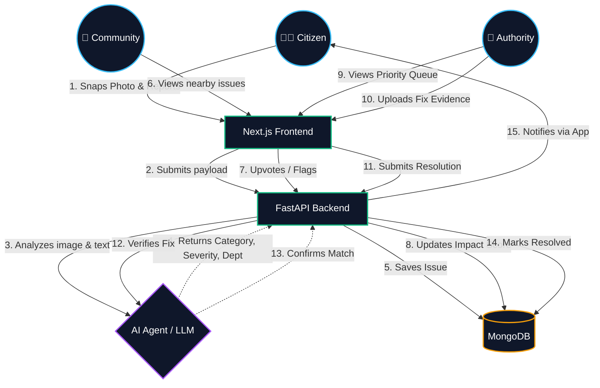

# CivicFix 🏙️

**Civic problems, solved &mdash; not just reported.**

CivicFix is a modern platform that streamlines the lifecycle of civic issues—from a citizen's initial report to an authority's confirmed fix. It leverages AI to autonomously classify, route, and prioritize reports, while relying on a verified community to validate issues and crowd-source impact.

## 🚀 Key Features

- **Effortless Reporting**: Snap a photo, add a short description, and your GPS location is captured automatically.
- **AI Priority Dispatch**: An autonomous agent analyzes the report, classifies it by department, and assigns a base severity score.
- **Community Issue Network**: Discover problems reported within a 50km radius. Citizens can verify genuine issues by upvoting them, which dynamically increases the issue's priority score.
- **Authority Console**: Civic departments receive a ranked, prioritized dashboard of issues, ensuring critical problems don't get lost in a queue.
- **Verification & Loop Closure**: Authorities must upload photographic evidence to close an issue. The original reporter is then notified that the problem has been solved.

## 🏗️ Architecture & User Flow



## 🛠️ Technology Stack

- **Frontend**: Next.js 15, React, Tailwind CSS v4, Lucide Icons
- **Backend**: FastAPI (Python), Pydantic
- **Database**: MongoDB (via Motor async driver)
- **Authentication**: Firebase Authentication
- **AI/Agents**: Google Gemini / LLM Integrations

## 💻 Local Development

### 1. Clone the Repository
```bash
git clone https://github.com/araj170805/hackrit.git
cd hackrit
```

### 2. Backend Setup
```bash
cd backend
python -m venv venv
# Windows: venv\Scripts\activate
# Mac/Linux: source venv/bin/activate

pip install -r requirements.txt
uvicorn main:app --reload
```

### 3. Frontend Setup
```bash
cd frontend
npm install
npm run dev
```

### Environment Variables
You will need a `.env` in the backend and a `.env.local` in the frontend containing your Firebase and MongoDB credentials.

## 🤝 Contributing
Contributions, issues, and feature requests are welcome! Feel free to check the issues page.
