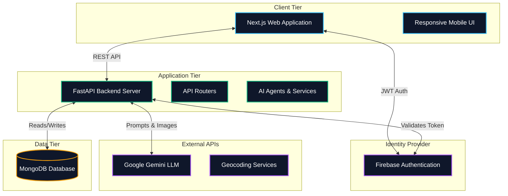
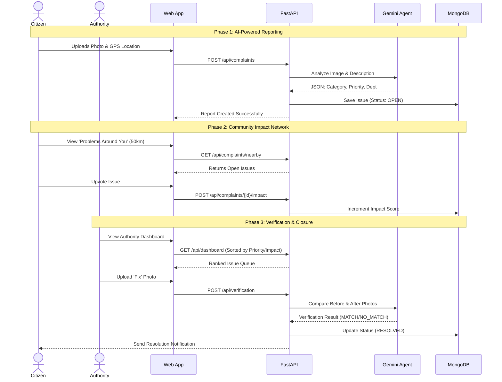

# CivicFix 🏙️

<p align="center">
  <b>Civic problems, solved &mdash; not just reported.</b>
</p>

CivicFix is a modern, AI-powered platform that revolutionizes how cities handle civic issues. By streamlining the entire lifecycle—from a citizen's initial report to an authority's confirmed fix—CivicFix ensures that critical infrastructure problems are resolved quickly, transparently, and efficiently.

---

## 🛑 The Problem
Traditional civic reporting systems are plagued by long forms, manual sorting, duplication, and zero transparency. Citizens report potholes or broken streetlights into a "black hole," never knowing if the issue was seen or fixed. Meanwhile, city authorities are overwhelmed with unclassified, unprioritized tickets.

## 💡 The Solution
CivicFix leverages **Generative AI** to autonomously classify, route, and prioritize reports based on photographic evidence. We combine this with a **Community Issue Network** that crowd-sources impact, dynamically pushing the most pressing problems to the top of the authority's queue. Finally, an AI-powered verification loop ensures that issues are only marked as "resolved" when visual evidence proves it.

---

## 🚀 Key Features

* **Effortless Reporting**: Snap a photo, add a short description, and your GPS location is captured automatically. No lengthy forms.
* **AI Priority Dispatch**: An autonomous agent analyzes the report image, extracts context, classifies it by department (e.g., Public Works, Sanitation), and calculates a base severity score.
* **Community Issue Network**: Discover problems reported within a 50km radius. Citizens can verify genuine issues by upvoting them, which dynamically increases the issue's priority score.
* **Smart Dashboard**: Civic departments receive a ranked, prioritized dashboard of issues, ensuring critical problems don't get lost in chronological queues.
* **AI Resolution Verification**: Authorities must upload photographic evidence to close an issue. The AI agent compares the "before" and "after" photos to verify the fix before closing the loop and notifying the citizen.

---

## 🏗️ System Architecture

Our system is broken down into a robust microservice-oriented architecture, utilizing modern web frameworks, NoSQL databases, and cloud-native AI models.



---

## 🔄 User & Data Flow

The following sequence diagram illustrates the lifecycle of a civic issue on the platform, from reporting to community validation and final authority resolution.



---

## 🛠️ Technology Stack

* **Frontend**: Next.js 15, React, Tailwind CSS v4, Lucide Icons, TypeScript
* **Backend**: FastAPI (Python), Pydantic, Uvicorn
* **Database**: MongoDB (via Motor async driver)
* **Authentication**: Firebase Authentication
* **AI/Agents**: Google Gemini API (Multimodal Image Analysis)

---

## 💻 Local Development

### 1. Clone the Repository
```bash
git clone https://github.com/araj170805/hackrit.git
cd hackrit
```

### 2. Backend Setup
```bash
cd backend
python -m venv venv

# Windows
venv\Scripts\activate
# Mac/Linux
source venv/bin/activate

pip install -r requirements.txt
uvicorn main:app --reload
```

### 3. Frontend Setup
```bash
cd frontend
npm install
npm run dev
```

### 4. Environment Variables
You will need to set up the following environment variables:
* **Backend (`backend/.env`)**: `MONGO_URI`, `GEMINI_API_KEY`, Firebase Admin credentials.
* **Frontend (`frontend/.env.local`)**: `NEXT_PUBLIC_FIREBASE_API_KEY`, etc.

---

## 🤝 Contributing
Contributions, issues, and feature requests are welcome! Feel free to check the issues page.
